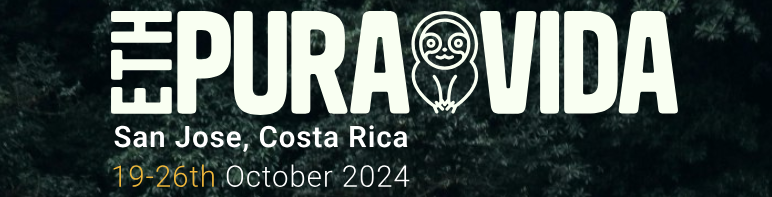

# Beyond Basics: Demystifying Web3 Wallets for Web2 Users

## Summary

Welcome to my talk on Web3 Wallets, titled **"Beyond Basics: Demystifying Web3 Wallets for Web2 Users"**. This session covers the essentials of Web3 wallets, their functionalities, and best practices for using them securely. Join us in exploring the future of decentralized finance (DeFi)!

## YouTube Playlist on Wallet Resources

Here is a curated playlist of YouTube videos to help you understand Web3 wallets in depth:
- [Blockchain Wallets](https://youtube.com/playlist?list=PLfqBbgB8zsBGJOSEolVSXh2ZcFEqHRt26&si=GWosfACx-YviDx3d)

## Additional Resources

Explore these links to dive deeper into the world of Web3 wallets and blockchain technology:
- [Great twitter thread on Wallets by nichanank](https://x.com/nichanank/status/1734569569568927806)
- [Wallet Best Practices](https://example.com/wallet-best-practices)

## Deeper Study

For those looking to expand their knowledge further, here are some recommended readings and courses:
- [Mastering Bitcoin by Andreas Antonopoulos](https://example.com/mastering-bitcoin)
- [Ethereum Development Course](https://example.com/ethereum-course)
- [Web3.js Documentation](https://web3js.readthedocs.io/)

## Contact

For any questions or further discussion, feel free to reach out at [robertosolano@duck.com](mailto:robertosolano@duck.com).

---

Remember to update the example URLs with actual paths and links relevant to your content. This should make for a comprehensive and engaging documentation of your Web3 Wallets talk! 🚀

